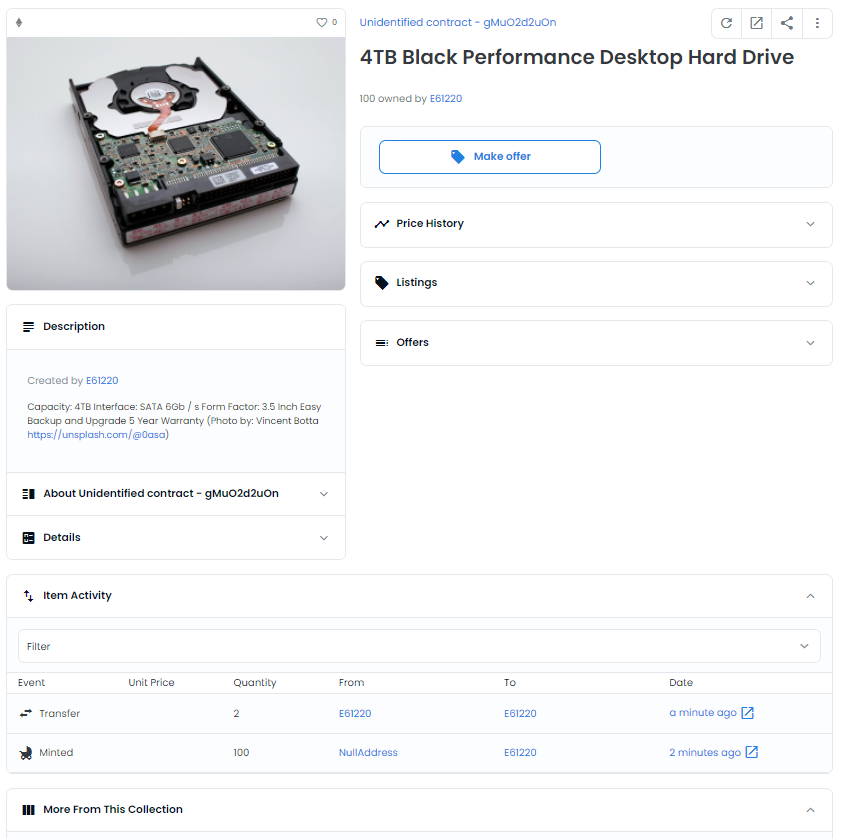

# Smart contracts templates for ERC721 - ERC1155 - Governor using Open Zeppelin smart contract library

Template to get started creating ERC721 NFTs - ERC1155  and DAO Governor using OpenZeppelin

For more information:

* ERC721 Spec https://eips.ethereum.org/EIPS/eip-721
* ERC1155 https://eips.ethereum.org/EIPS/eip-1155

Do you want to customise your contracts, check Open Zeppelin contract wizard https://wizard.openzeppelin.com/#erc721

# Installation Instructions 
+ Clone this repo
+ Npm install to download all the open zeppelin libraries
+ Run dotnet new -i .\ in the command line / terminal
+ Run dotnet new nethereum.oz --ContractLibrary "YourContractLibraryName"

# General notes
+ Nethereum code generation for all the services is already in place, if you want to alter your contract, open vscode solidity to compile and auto-generate your project.
+ You will need to "npm install" at root, this is necesary to retrieve the "openzeppelin" contracts 

## Integration testing configuration 
Integration testing can be configured to use different clients, see the Appsettings.test.json.

The current Client can be set to Geth, Ganache, Infura, External, Hardhat

When running Geth for integration testing locally (default), this is located in the ```testchain``` folder ```gethclique```. The windows executable it is already included for you.
If you want to update the version of geth or if you are using another OS just download the latest from https://geth.ethereum.org/downloads/ and set the correct path in EthereumTestSettings.

If you want to use a local node or custom url for integration testing, just use the External setting, and provide the HttpUrl.

Appsettings.test.json has a comments section describing each of the possible settings:

```json
{
  "EthereumTestSettings": {
    "GethPath": "..\\..\\..\\..\\testchain\\gethclique\\geth.exe",
    "AccountAddress": "0x12890d2cce102216644c59daE5baed380d84830c",
    "AccountPrivateKey": "0xb5b1870957d373ef0eeffecc6e4812c0fd08f554b37b233526acc331bf1544f7",
    "ManagedAccountPassword": "password",
    "ChainId": "444444444500",
    "Client": "Geth",
    "InfuraNetwork": "Rinkeby",
    "InfuraId": "INPUT INFURA ID HERE",
    "HttpUrl": "http://localhost:8545"
  },

  "Comments": {
    "GetPath": "This is the path to your geth executable , this is already set to your testchain path, with the preconfigured genesis, if you work on linux, mac download the right executable, and in windows to updated",
    "AccountAddress": "The account address of your private key",
    "AccountPrivateKey": "The private key to sign your transactions , preconfigured to the genesis test account used by Nethereum preconfigured testchain",
    "ManagedAccountPassword": "If you want to work with managed accounts , by the client, the password for your web3 storage",
    "ChainId": "The chainId of the node to connect",
    "Client": "Geth , Ganache, Infura, External, HardHat.. The client to connect to, if External it will use the HttpUrl",
    "InfuraNetwork": "The Infura network to connect to",
    "InfuraId": "The InfuraId to connect to",
    "HttpUrl":  "The external http url to connect to , i.e http://localhost:8545 or other testchains etc"
  }
}

```

# ERC721 The integration example
+ The preset contract can be found [here](contracts/MyERC721.sol).

+ Overall sample (Integration test)

```csharp

            //Using rinkeby to demo opensea, if we dont want to use the configured client
            //please input your infura id in appsettings.test.json
            var web3 = _ethereumClientIntegrationFixture.GetInfuraWeb3(InfuraNetwork.Rinkeby);
            //var web3 = _ethereumClientIntegrationFixture.GetWeb3(); //if you want to use your local node (ie geth, uncomment this, see appsettings.test.json for further info)
            //example of configuration as legacy (not eip1559) to work on L2s
            web3.Eth.TransactionManager.UseLegacyAsDefault = true;

            //creating our deployment information (this includes the bytecode already)
            //This example creates an NFT Property (Real state) registry
            var erc721Deployment = new ERC721EnumerableUriStorageDeployment() { Name = "Property Registry", Symbol = "PR" };

            //Deploy the erc721Minter
            var deploymentReceipt = await ERC721EnumerableUriStorageService.DeployContractAndWaitForReceiptAsync(web3, erc721Deployment);

            //creating a new service with the new contract address
            var erc721Service = new ERC721EnumerableUriStorageService(web3, deploymentReceipt.ContractAddress);

            //uploading to ipfs our documents
            var nftIpfsService = new NFTIpfsService("https://ipfs.infura.io:5001");
            var imageIpfs = await nftIpfsService.AddFileToIpfsAsync("Documents/TitlePlanImage.png");
            var titleIpfs = await nftIpfsService.AddFileToIpfsAsync("Documents/example_title_plan.pdf");
            var registerIpfs = await nftIpfsService.AddFileToIpfsAsync("Documents/example_register.pdf");
            
            //adding all our document ipfs links to the metadata and the description
            var metadataNFT = new NFTPropertyRegistryMetadata()
            {
                Name = "CS72510: Property registry example",
                AddressOfProperty = "23 Cottage Lane, Kerwick, PL14 3JP",
                Image = "ipfs://" + imageIpfs.Hash, //The image is what is displayed in market places like opean sea
                TitleDocument = "ipfs://" + titleIpfs.Hash,
                RegisterDocument = "ipfs://" + registerIpfs.Hash,
                PlanReference = "SD4008",
                TitleNumber = "CS72510",
                MapReference = "SY6676NE",
                ExternalUrl = "https://github.com/Nethereum/ERC721ContractLibrary.Template"

            };

            //Adding the metadata to ipfs
            var metadataIpfs =
                await nftIpfsService.AddNftsMetadataToIpfsAsync(metadataNFT, "PropertyRegistryMetadata.json");

            var addressToRegisterOwnership = "0xe612205919814b1995D861Bdf6C2fE2f20cDBd68";

            //Minting the nft with the url to the ipfs metadata
            var mintReceipt = await erc721Service.MintRequestAndWaitForReceiptAsync(
                addressToRegisterOwnership, "ipfs://" + metadataIpfs.Hash);

            //we have just minted our first nft so the nft will have the id of 0. 
            var ownerOfToken = await erc721Service.OwnerOfQueryAsync(0);

            Assert.True(ownerOfToken.IsTheSameAddress(addressToRegisterOwnership));

            var addressOfToken = await erc721Service.TokenURIQueryAsync(0);

            Assert.Equal("ipfs://" + metadataIpfs.Hash, addressOfToken);

            //Url format  https://testnets.opensea.io/assets/[nftAddress]/[id]
            //opening opensea testnet to visualise the nft
            var ps = new ProcessStartInfo("https://testnets.opensea.io/assets/"+ deploymentReceipt.ContractAddress+ "/0")
            {
                UseShellExecute = true,
                Verb = "open"
            };
            Process.Start(ps);
```
Metadata example: https://bafkreia62g7siwpqowu26t2dmyy575e4hwmoaxsdaadb4fnlb2mmkuvy7y.ipfs.dweb.link/


# ERC1155 The integration example
+ The preset contract can be found [here](contracts/MyERC1155.sol).

+ Overall sample (Integration test)

```csharp

            //Using rinkeby to demo opensea, if we dont want to use the configured client
            //please input your infura id in appsettings.test.json
            var web3 = _ethereumClientIntegrationFixture.GetInfuraWeb3(InfuraNetwork.Rinkeby);
            //var web3 = _ethereumClientIntegrationFixture.GetWeb3(); //if you want to use your local node (ie geth, uncomment this, see appsettings.test.json for further info)
            //example of configuration as legacy (not eip1559) to work on L2s
            web3.Eth.TransactionManager.UseLegacyAsDefault = true;

 
            var ercERC1155Deployment = new MyERC1155Deployment(); 
            //Deploy the 1155 contract (shop)
            var deploymentReceipt = await MyERC1155Service.DeployContractAndWaitForReceiptAsync(web3, ercERC1155Deployment);

            //creating a new service with the new contract address
            var erc1155Service = new MyERC1155Service(web3, deploymentReceipt.ContractAddress);

            //uploading to ipfs our documents
            var nftIpfsService = new NFTIpfsService("https://ipfs.infura.io:5001");
            var imageIpfs = await nftIpfsService.AddFileToIpfsAsync("ShopImages/hard-drive-by-vincent-botta-from-unsplash.jpg");


            //adding all our document ipfs links to the metadata and the description
            var metadataNFT = new ProductNFTMetadata()
            {
                ProductId = 12131,
                Name = "4TB Black Performance Desktop Hard Drive",
                Image = "ipfs://" + imageIpfs.Hash, //The image is what is displayed in market places like opean sea
                Description = @"Capacity: 4TB
                                Interface: SATA 6Gb / s
                                Form Factor: 3.5 Inch
                                Easy Backup and Upgrade
                                5 Year Warranty (Photo by: Vincent Botta https://unsplash.com/@0asa)",
                ExternalUrl = "https://github.com/Nethereum/ERC721ContractLibrary.Template",
                Decimals = 0
            };
            var stockHardDrive = 100;
            //Adding the metadata to ipfs
            var metadataIpfs =
                await nftIpfsService.AddNftsMetadataToIpfsAsync(metadataNFT, metadataNFT.ProductId + ".json");

            var addressToRegisterOwnership = "0xe612205919814b1995D861Bdf6C2fE2f20cDBd68";

            //Adding the product information
            var tokenUriReceipt = await erc1155Service.SetTokenUriRequestAndWaitForReceiptAsync(metadataNFT.ProductId,
                 "ipfs://" + metadataIpfs.Hash);

            var mintReceipt = await erc1155Service.MintRequestAndWaitForReceiptAsync(addressToRegisterOwnership, metadataNFT.ProductId, stockHardDrive, new byte[]{});


            // the balance should be 
            var balance = await erc1155Service.BalanceOfQueryAsync(addressToRegisterOwnership, (BigInteger)metadataNFT.ProductId);

            Assert.Equal(stockHardDrive, balance);

            var addressOfToken = await erc1155Service.UriQueryAsync(metadataNFT.ProductId);

            Assert.Equal("ipfs://" + metadataIpfs.Hash, addressOfToken);

            //Url format  https://testnets.opensea.io/assets/[nftAddress]/[id]
            //opening opensea testnet to visualise the nft
            var ps = new ProcessStartInfo("https://testnets.opensea.io/assets/" + deploymentReceipt.ContractAddress + "/" + metadataNFT.ProductId)
            {
                UseShellExecute = true,
                Verb = "open"
            };
            Process.Start(ps);

            //lets sell 2 hard drives 
            var transfer = await erc1155Service.SafeTransferFromRequestAndWaitForReceiptAsync(addressToRegisterOwnership, addressToRegisterOwnership, (BigInteger)metadataNFT.ProductId, 2, new byte[]{});
            Assert.False(transfer.HasErrors());

```

